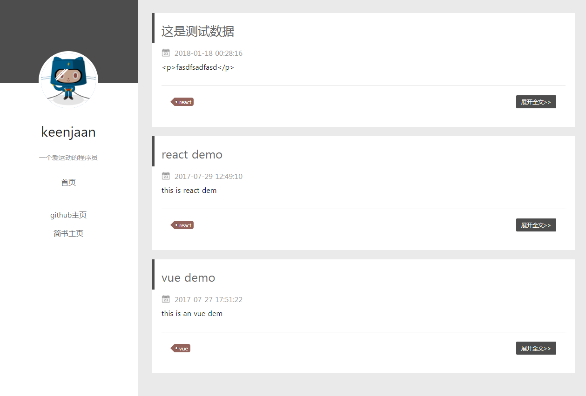
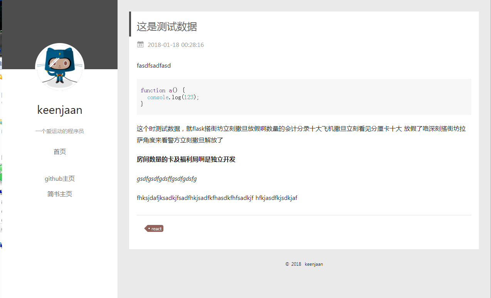
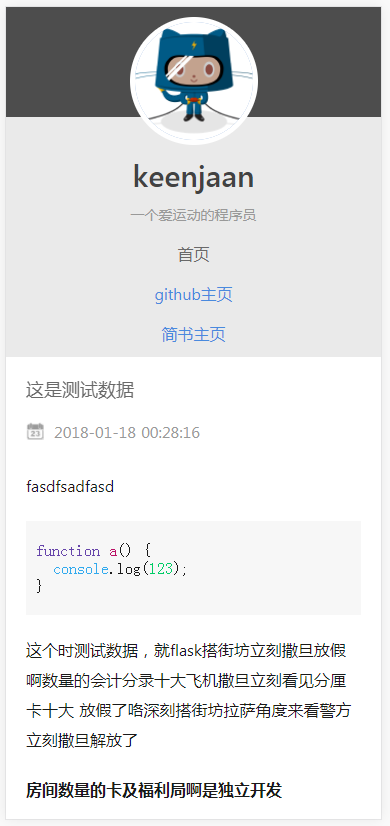

### 说明

本项目是个人博客搭建项目之一，本来打算放在一个项目里的，但是放在一个项目里代码会比较乱，所以分开多个项目来管理。关于整个博客项目的搭建以及介绍可以参考我的这篇博文。


本项目为博客前端项目，其他项目地址：

[博客后台管理页面](https://github.com/keenjaan/blog-admin)

[博客后端接口及文档](https://github.com/keenjaan/blog-api)

这三个项目完成了整个博客的构建，剩下的就是服务端部署，由于之前没有接触过服务端部署，所以什么东西都是现学，把服务器部署整个过程记录下来了。关于服务端配置仅供参考因为我也是新手。

[node项目部署——阿里云centos部署ftp](https://www.jianshu.com/p/7258a75798c4)

[node项目部署——阿里云cento部署node和nginx](https://www.jianshu.com/p/7aad651bdbb4)

[node项目部署——阿里云centos部署git服务](https://www.jianshu.com/p/d7713fbd3e5d)

[node项目部署——阿里云centos部署mongodb](https://www.jianshu.com/p/b5fd46aaec43)

项目已在服务器上正常跑起来了。


####  项目说明

> Nuxt.js project

本项目是为了试一下vue ssr而做的项目，使用的是nuxt。


本项目使用的是nuxt 1.00，按照官方说明，nuxt 1.00基于node 8.00以上版本，所以本地要安装8.00以上版本。推荐使用nvm管理多版本node，切换版本非常方便。

#### 运行项目

``` bash
# 克隆项目
$ git clone git@github.com:keenjaan/blog.git

#进入blog目录安装依赖
$ npm install # Or yarn install

# 启动热更新 at localhost:3333
$ npm run dev

# 生产环境打包和启动服务
$ npm run build
$ npm start

# 生产静态目录
$ npm run generate
```

关于nuxt教程还是推荐看官方文档，写的比较详细 [Nuxt.js docs](https://github.com/nuxt/nuxt.js).

#### 项目截图





 